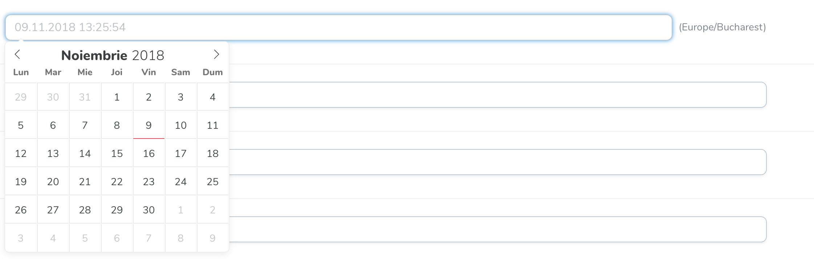

# Romanian DateTime

##### Romanian Date Picker for Laravel Nova

Apply Romanian localisation to Laravel Nova's default `DateTime` field that currently doesn't support localisation out of the box.

This package uses the airbnb theme.



## Install

In order to install this, run the following command:

```bash
composer require niladam/romanian-date-time
```

## Usage

The API is almost the same as with [Nova's default `DateTime` Field](https://nova.laravel.com/docs/1.0/resources/fields.html#datetime-field) except for the `enableTime()` function which enables the time picker which is disabled by default.

Use `RomanianDateTime` class instead of `DateTime` directly or use it like an alias in the below example in order to not refactor too much.

```php
<?php

namespace App\Nova;

use Illuminate\Http\Request;
use Madalin\RomanianDateTime\RomanianDateTime as DateTime;

class User extends Resource
{
    /**
     * The model the resource corresponds to.
     *
     * @var string
     */
    public static $model = 'App\User';

    /**
     * The single value that should be used to represent the resource when being displayed.
     *
     * @var string
     */
    public static $title = 'name';

    /**
     * The columns that should be searched.
     *
     * @var array
     */
    public static $search = ['name',
                             'email'];

    /**
     * Get the fields displayed by the resource.
     *
     * @param  \Illuminate\Http\Request $request
     * @return array
     */
    public function fields(Request $request)
    {
        return [
            ID::make()->sortable(),

            Text::make(__('Name'), 'name')
                ->sortable()
                ->rules('required', 'max:255'),

            Text::make(__('Email Address'), 'email')
                ->sortable()
                ->rules('required', 'email', 'max:254')
                ->creationRules('unique:users,email')
                ->updateRules('unique:users,email,{{resourceId}}'),

            Password::make(__('Password'), 'password')
                    ->onlyOnForms()
                    ->creationRules('required', 'string', 'min:6')
                    ->updateRules('nullable', 'string', 'min:6'),

            DateTime::make(__('Created at'), 'created_at')
                    ->format('DD.MM.YYYY')
                    ->creationRules('required', 'date')
                    ->sortable(),

            DateTime::make(__('Updated at'), 'updated_at')
                    ->format('DD.MM.YYYY HH:mm:ss')
                    ->enableTime()
                    ->updateRules('required', 'date')
                    ->hideFromIndex(),
        ];
    }
}

```

## Thanks

This package uses parts from the one originally built by [Klemen Tušar](https://github.com/techouse/slovenian-date-time)
